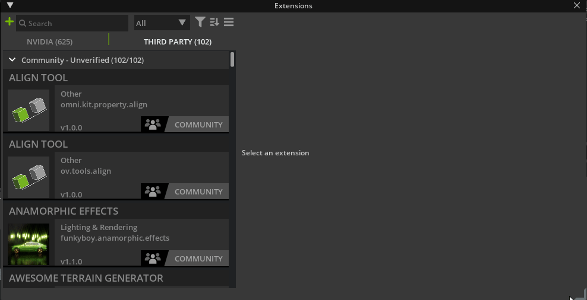
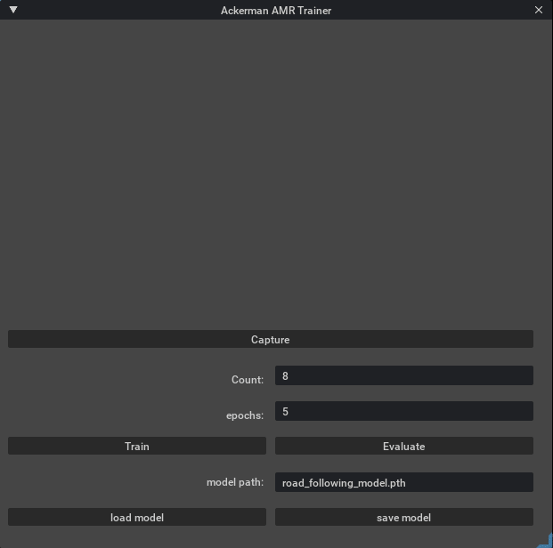

# ackermann AMR Trainer [omni.sample.ackermann_AMR_Trainer]

<div style="text-align: center;">
    
</div>

This is a sample extension that helps train an AI model to drive an ackermann-based autonomous mobile robot (AMR) in NVIDIA Isaac Sim. The full source code along with assets can be found [here](https://github.com/NVIDIA-Omniverse/kit-extension-sample-ackermann-amr-trainer).

## [Tutorial](../tutorial/tutorial.md)

This extension sample includes a step-by-step tutorial to demonstrate portions of how it was written. [Learn how with the tutorial.](../tutorial/tutorial.md)

## Usage

In order to use this sample you must install *Omniverse*, clone this repository, and configure *Omniverse* to include the provided extension. Then the extension can be used as described below.

### Install Omniverse Launcher and an Omniverse App

1. Install *Omniverse Launcher*: [download](https://www.nvidia.com/en-us/Omniverse/download)
2. Install and launch an *Omniverse* app through the launcher such as *Omniverse Code*.

## Adding This Extension to your *Omniverse App*

### Directly from Github

To add a this extension to your Omniverse app directly from github:
1. Go into: Extension Manager &rarr; Hamburger Menu &rarr; Settings &rarr; Extension Search Paths

<div style="text-align: center;">
    
</div>

2. Add this as a search path: `git://github.com/NVIDIA-Omniverse/kit-extension-sample-spawn-prims.git?branch=main&dir=exts`

### With Source

#### Adding the Source to Omniverse

1. Fork and clone this repo, for example in `C:\projects\kit-extension-sample-ackermann-amr-trainer`
2. In the *Omniverse App* open extension manager: *Window* &rarr; *Extensions*.
3. In the *Extension Manager Window* click on the *hamburger menu* &rarr; *settings*.
4. In the settings page there is a list of *Extension Search Paths*. Click on the *plus* button and add the cloned repo's `exts` subfolder. If you used the example clone path, the `exts` filder would be here: `C:\projects\kit-extension-sample-ackermann-amr-trainer\exts`

<div style="text-align: center;">
    
</div>

5. Now you can find `omni.sample.excel_amr_trainer` extension in the top left search bar. Select and enable it.
6. The "ackermann AMR Trainer" window will pop up. *Extension Manager* watches for any file changes. You can try changing some code in this extension and see them applied immediately with a hotreload.

#### Linking with an Omniverse app

For a better developer experience, it is recommended to create a folder link named `app` to the *Omniverse Kit* app installed from *Omniverse Launcher*. A convenience script to use is included.

Run:

```bash
> link_app.bat
```

If successful you should see `app` folder link in the root of this repo.

If multiple Omniverse apps is installed script will select recommended one. Or you can explicitly pass an app:

```bash
> link_app.bat --app code
```

You can also just pass a path to create link to:

```bash
> link_app.bat --path "C:/Users/bob/AppData/Local/ov/pkg/create-2022.1.3"
```

## Using the Extension

### Open the Scene

Use the *Omniverse* app installed previously to open *Racing_Grid.usd* included in the *Assets* folder of the repository.

### Activate the ackermann_AMR_Controller

Activate the *ackermann_AMR_Controller* Extension by clicking on the `+` button. 

### Start a Physics Simulation

Start the Isaac Sim simulation by pressing the `play` button or by pressing the `spacebar`. Press the forward arrow on your keyboard or the `a` button on your game pad to start the car driving forward. Steer the car within the cones as it drives forward.

### Collect Annotated Data

Press the `Capture` button to save the current viewport to file. Then click the point in the distance on the image where you would steer the car. This will rename the image file by prepending the `x` and `y` coodinates you have clicked.

<div style="text-align: center;">
    
</div>

You can see how many images you have collected in the `Count` field.

> **_Note_**: Remember that you are collecting this data to teach an AI to drive! Do not just collect data along a perfect driving line; collect data off of the ideal line in order to teach the AI how to get back on course if it gets a little lost.

### Train the Model

To train your model set the number of epochs you would like to train in the `epochs` field. If you are not sure what to use, five epochs is a good start.

Next, click on the `train` button. You can see the loss after each epoch printed in the Isaac Sim command prompt as it trains or all printed at once in the Isaac Sim console after training has completed. 

If you are unhappy with the loss value, simply click on the train button again and the model will continue to train for as many epochs as are indicated in the `epochs` field. 

### Load and Save the Model

The model can be loaded and saved from the path indicated in the `model path` field by clicking on the `load model` and `save model` fields respectively. 

A saved model can be used in future sessions or deployed to a ROS node so that the car can drive itself!