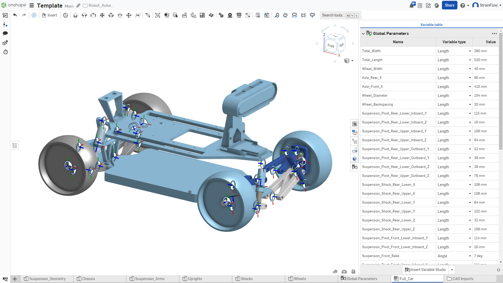
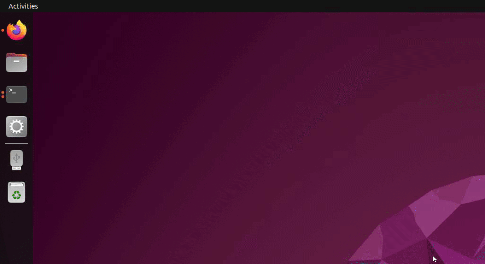
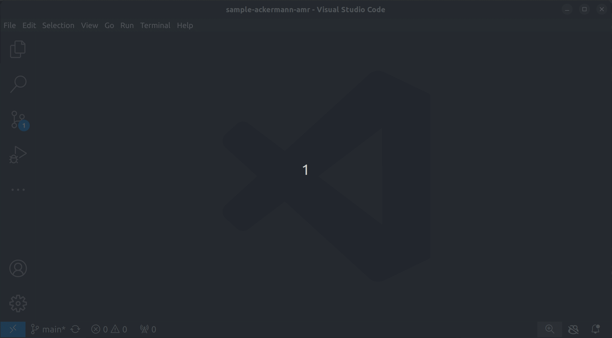
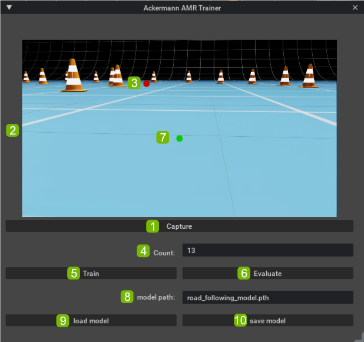
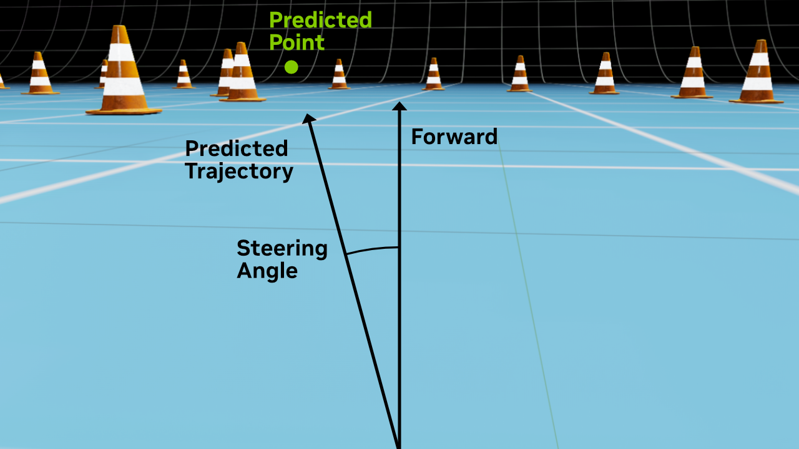

# Train an ackermann Autonomous Mobile Robot to drive Itself with NVIDIA Omniverse and ROS

Follow along with this tutorial to learn how to use a combination of CAD templates, NVIDIA Omniverse Extensions, and Robot Operating System (ROS) to build and train your own virtual ackermann autonomous mobile robot (AMR).

## Learning Objectives

* Learn the entire workflow to take an Autonomous Mobile Robot (AMR) from concept to reality
* See a USD pipeline in action
* Create a USD scene to train an AMR
* Use Robot Operating System (ROS) 2 to manually control an AMR
* Write an Omniverse extension to train an AMR
* Create ROS 2 nodes to autonomously control the robot

## Prerequisites

* Ubuntu 22.04
* Isaac Sim 2023.1.1 or higher
* ROS 2 Humble
* Clone this Repository
* Install ROS dependencies. (This can be done by running `prerequisites.sh` in the repository's `ros2_f1_tenth_trainer` folder) 

## 1 From Concept to Simulation

An ackermann AMR is an autonomous mobile robot that steers and drives like a car. It has four wheels, two or four-wheel drive, and the two front wheels steer. In this tutorial you will be shown an end-to-end workflow that can be used to train a 1/10 scale remote control car to drive itself in a virtual environment.

### 1.1 The Ackermann AMR Onshape Template

The first step to develop a real-world AMR is to model one in CAD.

#### 1.1.1 Open the OnShape ackermann AMR Template

Open the OnShape <a href="https://cad.onshape.com/documents/836767cd08a2800e8a9d4cb0/w/91eb0ff38b3ab8b03ea0db77/e/9015511e4d7c44d4d48e3cf2?renderMode=0&uiState=65bd4308b58f851a1d4b4096" target="_blank">ackermann AMR template</a>

<figure style="text-align: center;">
    
    <figcaption>Onshape Ackermann AMR Template</figcaption>
</figure>

The ackermann AMR template makes this easy; if you wanted to customize the template, you would just enter your car's measurements into the parameter table and then import the model into Omniverse. If you are working with the a traxxas slash-based vehicle such as the F1Tenth platform you do not need to change anything because it already matches your suspension geometry!

### 1.2 The ackermann AMR Template USD Pipeline

The Ackermann AMR template has been imported directly into Omniverse with the OnShape Importer extension. The resulting USD file has geometry and basic joint definitions, but is far from ready to simulate. This section demonstrates a powerful USD pipeline that will automatically prepare an imported ackerman AMR template model for simulation.

#### 1.2.1 Open Isaac Sim

Open Isaac Sim, making sure that under `ROS Bridge Extension`, `omni.isaac.ros2_bridge` is selected.

<figure style="text-align: center;">
    
    <figcaption>Launch Isaac Sim</figcaption>
</figure>

#### 1.2.2 Open the Fully Rigged Vehicle

Go to the content browser tab at the bottom of the screen and enter `/home/nvidia/DLIT61797/sample-ackermann-amr/assets/` into its address bar where *nvidia* should be replaced with your logged in username. This will open a folder with a number of useful assets for this tutorial. Double click on the *F1Tenth.usd* file to open it.

<figure style="text-align: center;">
  
  <figcaption>Open F1Tenth.usd</figcaption>
</figure>


#### 1.2.3 Simulate the Vehicle

Press the `play` button to see the car simulate. `Shift+click` on the car and then drag the mouse to interact with it during simulation. Press the `stop` button to reset the simulation. Take note that the simulation behaves well and that there are no warnings or errors.

<figure style="text-align: center;">
    
  <figcaption>Simulate the Working Vehicle</figcaption>
</figure>

> **_NOTE_**: If at any time you edit this asset, it may not work properly. If your edits show up as deltas in the `Root Layer` in the Layer pane, this layer is intentionally left empty for this very reason; you can delete any deltas in that layer. If that doesn't work, just re-open `F1Tenth.usd` and do not save your changes. Accidently saved your changes? Check out the appendix at the end to see how to reset your files.

#### 1.2.4 Mute All Layers

Open the Layer tab and mute each layer by clicking on the `eye` icon until the car disapears completely.

<figure style="text-align: center;">
        
    <figcaption>Mute All Layers in F1Tenth.usd</figcaption>
</figure>

USD Layers do not simply serve for organization; they work more like macros! Layers have a list of changes, or deltas, that are made to the USD stage tree. In this case, we import the CAD template and then these layers automatically prepare it for simulation.

> **_NOTE_**: Roughly speaking, any prim attributes values (opinions) in a layer take precedence over layers below them. For more detailed information on the prioritization of layer opinions (LIVRPS), please read the [USD Documentation](https://openusd.org/release/glossary.html#livrps-strength-ordering)

#### 1.2.5 Unmute Full_Car_base.usd

Unmute `Full_Car_base.usd` by clicking on its `eye` icon to make the car appear.

Select `Full_Car_base.usd` and press the `F` key to fit the robot to the screen.

<figure style="text-align: center;">
        
    <figcaption>Unmute Full_Car_Base.usd</figcaption>
</figure>

This layer is created by the OnShape import and is the base of the asset. Press the `play` button to start a simulation, you will notice that the car simply falls, has incorrect joint rigging and quite a few errors. Press the `stop` button to reset the simulation.

#### 1.2.6 Unmute Reparenting.usd, Mass_Properties.usd and Joint_Rigging.usd fff

Unmute `Reparenting.usd`, `Mass_Properties.usd`, and `Joint_Rigging.usd`.

Expand `Joint_Rigging.usd`, select `World` &rarr; `Full_Car` and press the `F` key to fit the ackermann robot to the screen. 

<figure style="text-align: center;">
        
    <figcaption>Unmute the Next Three Layers</figcaption>
</figure>

These layers rearrange the stage tree, apply correct mass properties and fix a number of issues with the joints. 

#### 1.2.7 Simulate Robot

Press `play` now; the car should once again simulate well and without errors. 

<figure style="text-align: center;">
        
    <figcaption>Simulate the Vehicle with Rigged Joints</figcaption>
</figure>

#### 1.2.8 Unmute Remaining Layers

Unmute `Materials.usd`, `Cameras.usd`, and `Make_Asset.usd`.

<figure style="text-align: center;">
        
    <figcaption>Unmute Remaining Layers</figcaption>
</figure>

If you replace `Full_Car_Base.usd` with a new CAD import, these layers will make the same changes to that version of the template, giving you an asset that is ready to drive around a scene.

### 1.3 Add a ROS Isaac Sim bridge Action Graph to the F1Tenth Car

Next we will add two Robot Operating System (ROS) action graphs to the `F1Tenth` asset so that it can send images to and be controlled by ROS.

#### 1.3.1 Add `ROS_Actiongraph.usd` to the Pipeline

Drag `ROS_Actiongraph.usd` from the content browser and drop it into the **Layer** window, making sure it is above all other sub-layers.

<figure style="text-align: center;">
        
    <figcaption>Add ROS Action Graphs to the Scene</figcaption>
</figure>

#### 1.3.2 See the Changes to the Scene

Navigate to the stage tree to see the two action graph nodes that have been added to the scene.

<figure style="text-align: center;">
        
    <figcaption>View Added Action Graphs in the Stage Tree</figcaption>
</figure>

This layer behaves as a macro that adds the two action graphs to the stage tree under the *Full_Car* prim. The `ROS_Sensors` graph publishes the cameras and sensors from the template for other ROS nodes to subscribe to. The `ROS_Ackermann_Drive` graph listens for ROS nodes that send driving commands so that it can be controlled by other ROS nodes.

> **_NOTE_**: You can open `F1Tenth_ROS.usd` to catch up to this point.

### 1.4 Create a USD Scene of a Race Track

Now that the car is ready for physics simulation, we will create a scene with a race track and add the car to it.

#### 1.4.1 `Open Raceing_Grid_Start.usd`

Find `Racing_Grid_Start.usd` in the content browser and double click it to open it.

<figure style="text-align: center;">
        
    <figcaption>Open Racing_Grid_Start.usd</figcaption>
</figure>

#### 1.4.2 Add the `F1Tenth_ROS.usd` to the scene

To add the car to the scene, drag the `F1Tenth_ROS.usd` asset from the content browser and drop it into the stage tree window. 

<figure style="text-align: center;">
        
    <figcaption>Add the Car to the Scene</figcaption>
</figure>

#### 1.4.3 Rotate the Robot 90 degrees

Click on the `F1Tenth_ROS` prim in the stage tree and in the properties pane, set it's `Z` rotation to `-90`. 

<figure style="text-align: center;">
        
    <figcaption>Rotate the Car -90 degrees about the Z-axis</figcaption>
</figure>

#### 1.4.4 Simulate the Robot

You can press `play` to start the physics simulation. Press `stop` to reset the simulation. Please keep in mind that the car will not roll during simulation because the wheels are locked until they receive a ROS message.

<figure style="text-align: center;">
        
    <figcaption>Simulate the Car in the Scene</figcaption>
</figure>

> **_NOTE_**: To catch up to this point, open `Racing_Grid.usd` in the content browser.

### 1.5 Write a ROS 2 Node to Manually Control the Robot

Next we will write a ROS 2 node in python that can manually control the robot. 

> **_NOTE_**: If you are new to python, the indentation of your code is critical! Your code will not work correctly if it is not indented correctly because the indentation defines the scope. The Comment for each line of code you will insert is indented correctly, so if you copy-paste the code from this tutorial, align it with the matching comments in the source files, and double check the indentation is the same there as it is in this tutorial, your indentation should be correct.

#### 1.5.1 Open the `sample-ackermann-amr` Folder in Visual Studio Code

In a terminal run the following commands to change to the sample-ackermann-amr directory and open it in Visual Studio Code: 

```bash
cd ~/source/sample-ackermann-amr/
code .code
```

<figure style="text-align: center;">
        
    <figcaption>Launch VS Code</figcaption>
</figure>

#### 1.5.2 Open *teleop_ackermann_key_start*

Next, open *teleop_ackermann_key_start.py* found in *ros2_f1_tenth_trainer*. 

<figure style="text-align: center;">
    
    <figcaption>Open <em>teleop_ackermann_key_start.py</em></figcaption>
</figure>

This ROS Node uses `pynput` to access keyboard events. It detects whether a key has been pressed and then sends that as a message from a ROS node for other ROS nodes to list and respond to. 

#### 1.5.3 Respond to Key Presses

Second, in the `on_press` function, add the following code:

```python
# 1.5.3 Create ROS Messages based on keys pressed
if key.char == 'w':
    self.drive_msg.drive.speed = 2.0 # Drive Forward
elif key.char == 's':
    self.drive_msg.drive.speed = -2.0 # Drive Backward
elif key.char == 'a':
    self.drive_msg.drive.steering_angle = 0.523599  # Turn left by 30 degrees
elif key.char == 'd':
    self.drive_msg.drive.steering_angle = -0.523599  # Turn right by 30 degrees
```

This code responds to `wasd` key presses by steering and driving the car.

<details>
    <summary>Completed Code</summary>

```Python
def __init__(self):
    super().__init__('keyboard_teleop')
    # 1. Create the publisher and message
    self.publisher_ = self.create_publisher(AckermannDriveStamped, 'ackermann_cmd', 10)
    self.drive_msg = AckermannDriveStamped()
    self.listener = keyboard.Listener(on_press=self.on_press, on_release=self.on_release)
    self.listener.start()
    self.timer_period = 0.1  # seconds
    self.timer = self.create_timer(self.timer_period, self.publish_cmd)

def on_press(self, key):
    try:
        # 2. Create ROS Messages based on keys pressed
        if key.char == 'w':
            self.drive_msg.drive.speed = 2.0 # Drive Forward
        elif key.char == 's':
            self.drive_msg.drive.speed = -2.0 # Drive Backward
        elif key.char == 'a':
            self.drive_msg.drive.steering_angle = 0.523599  # Turn left by 30 degrees
        elif key.char == 'd':
            self.drive_msg.drive.steering_angle = -0.523599  # Turn right by 30 degrees
    except AttributeError:
        pass

def on_release(self, key):
    try:
        # 3. If no keys are pressed, stop the car
        if key.char in ['w', 's']:
            self.drive_msg.drive.speed = 0.0 # stop driving
        elif key.char in ['a', 'd']:
            self.drive_msg.drive.steering_angle = 0.0 # stop turning
    except AttributeError:
        pass

def publish_cmd(self):
    # 4. Publish the Message
    self.drive_msg.header.frame_id = "f1_tenth"
    self.drive_msg.header.stamp = self.get_clock().now().to_msg()
    self.publisher_.publish(self.drive_msg)
```
</details>

#### 1.5.4 Start the ROS Node

To run the ROS2 node, open a terminal and run the following command: 

```bash
cd ~/source/sample-ackermann-amr/ros2_f1_tenth_trainer
```

Then launch the ROS2 node with this command: 

```bash
python3 teleop_ackermann_key_start.py
```

If you are having trouble, run the completed code instead: 

```bash
python3 teleop_ackermann_key.py
```

#### 1.5.5 Change to the Chase Camera

Click on the camera icon on the upper left of the viewport and change to `Cameras` &rarr; `camera_chase`.

<figure style="text-align: center;">
    
    <figcaption>Change to the chase camera</em></figcaption>
</figure>

#### 1.5.6 Start the Omniverse Simulation

Open Omniverse and click the `play` button or press the `spacebar` to start the physics simulation. 

<figure style="text-align: center;">
    
    <figcaption>Start the simulation</em></figcaption>
</figure>

#### 1.5.7 Drive the Car in the Scene

Drive the car in the scene with the `wasd` keys. 

<figure style="text-align: center;">
    
    <figcaption>Drive the car with the WASD keys</em></figcaption>
</figure>

Be careful, if you have a text-entry window or element selected such as the terminal or text box, it will capture your key presses. 

> **_NOTE_**: Is the car slipping and sliding when you drive it? This material should be applied to any ground planes when you add this asset to a scene or else the friction will only be half what you expect!

#### 1.5.8 Stop the Simulation

Stop and reset the simulation by clicking the `stop` button or by pressing the `spacebar`.

<figure style="text-align: center;">
    
    <figcaption>Stop the simulation</em></figcaption>
</figure>

#### 1.5.9 Stop the ROS Node

Stop the ROS node by selecting its terminal and pressing `ctrl + c`. 

> **_CHALLENGE_**: Remember, `teleop_ackermann_key.py` will be used to drive the car as you collect annotated data for AI model training. With that in mind, how might you change how the robot is controlled to make it easier to collect data?

## 2 Write an Omniverse Extension to Train the Driving Model

Now that we can perform a physics simulation of the robot navigating an environment, the next step is to collect annotated data and train a model that can drive the car autonomously.

### 2.1 The Ackermann Trainer Extension User Interface

In this section we will create the Ackermann Trainer Extension's graphical user interface. 

#### 2.1.1 Training Workflow Overview

In order to train a computer-vision based supervised-learning AI for an AMR we need to take the following steps: 

* Capture images from the robot's camera. 
* Annotate the images with data we would like the model to predict
* Train a model from the dataset 
* Validate whether the model is trained well enough
* Save the model so we can use it to actually drive our autonomous robot!

Here is the user interface that guides a user through that workflow: 

<figure style="text-align: center;">
    
    <figcaption>The Ackermann Trainer Window User Interface</figcaption>
</figure>

The controls of the window are as follows. 

1. The `Capture` button captures the current viewport, saves a copy and displays it in the user interface.
2. The captured viewport is displayed here.
3. Clicking on a captured image annotates the image with the coordinates you have clicked.
4. `Count` displays the number of annotated images in your currently loaded dataset.
5. The `Train` button trains the model for one epoch
6. The `Evaluate` starts repeatedly capturing the current viewport and evaluating it with your current model.
7. With each iteration of `Evaluate`, the predicted point appears as a green dot. Clicking the `Evaluate` button again will stop evaluation.
8. The `Model Path` attribute determines the file name your model will load from and save to.
9. The `Load Model` button loads the model.
10. The `Save Model` buttons saves the model.

#### 2.1.2 Capture the Viewport to File

Next we will write the code for most of these UI elements. In VS Code, navigate to *exts/omni.sample.ackermann_amr_trainer/omni/sample/ackermann_amr_trainer*, open `ackermann_trainer_window_start.py`, and find the `capture_image` function. Enter the following snippet which captures the viewport to file: 

```python
# 2.1.2 Capture the Viewport to File
viewport = get_active_viewport()
capture_viewport_to_file(viewport, file_path=file_path)
```

When you click on the `Capture` button, it calls the `OnCapture` function. `OnCapture` calls `capture_image` asynchrounously which in turn calls `replace_image`. 

#### 2.1.3 Update the UI Thumbnail Image

In the `replace_image` function, paste `self.file_name` into the `ui.Image()` constructor as shown below: 

```python
# 2.1.3 Update the image from the capture
ui.Image(self.file_path)
```

The `replace_image` function redraws the thumbnail image and its annotations.

#### 2.1.4 Add Annotation to Dataset

The image displayed in the user interface is clickable and fires the `onMouseReleased` function when clicked. Add the following code to capture the click coordinates and add the image with its annotation to the model's dataset.

```python
# 2.1.4 Capture Click Position
self.click_x, self.click_y = canvas.screen_to_canvas(x, y)

# 2.1.4 Add Image to Dataset
self.file_path = self.model.add_item(self.click_y,
                                     self.click_x,
                                     self.file_path)
```

> **_NOTE_**: The `add_item` function is a member of `ackermann_amr_model`, which will be discussed in section 2.2.

#### 2.1.5 Update the Image Annotation

Next we return to `replace_image` where we set the `x` and `y` positions of the red annotation dot. This is done by adding `self.click_x` and `self.click_y` to the spacers above and to the left of the red dot: 

```python
# 2.1.5 Set Annotation Y-Position
ui.Spacer()
with ui.HStack(height=self.click_y):
    # 2.1.5 Set Annotation Z-Position
    ui.Spacer(width=self.click_x)
    style = {"Circle": {"background_color": cl("#cc0000"),
                        "border_color": cl("#cc0000"),
                        "border_width": 2}}
    ui.Circle(width=10,
                height=10,
                alignment=ui.
                Alignment.LEFT_TOP,
                style=style)
```

This places the red dot where the user clicked. 

#### 2.1.6 Train the Model

Next, inside the `train` function, add the following code to train the model: 

```python
# 2.1.6 Train AI Model
self.model.train()
```

This function will train the model for one epoch each time it is run.

> **_NOTE_**: The model and its training function will be discussed in section 2.2

#### 2.1.7 Evaluating the Model

Add the viewport capture code to `on_update`: 

```python
# 2.1.7 Capture the Viewport to Buffer
viewport_api = get_active_viewport()
capture_viewport_to_buffer(viewport_api, self.on_viewport_captured)
```

This captures the viewport to a buffer and then calls `on_viewport_captured`. Add the following to `on_viewport_captured` to evaluate the given viewport capture: 

```python
# 2.1.7 Evaluate Viewport Image
self.prediction_y, self.prediction_x = self.model.Evaluate(buffer,
                                                            buffer_size,
                                                            width,
                                                            height,
                                                            self.thumbnail_width,
                                                            self.thumbnail_height)
```

> **_NOTE_**: The `Evaluate` function is in `ackermann_amr_model`, which will be discussed in section 2.2.

The evaluate model functionality in this extension can be toggled on and off with a toggle-button. While on, the extension will send the current viewport through the AI model every 30 frames and will annotate the window's thumbnail with the predicted coordinates continuously. While toggled off, no evaluations are made.

#### 2.1.8 Load and Save Model

The final step in the workflow is to load and save the model with the following functions which are tied to the callbacks from the `load` and `save` buttons:

```python
# 2.1.8 Load the Model
def onLoadModel(self):
    self.model.load(self.model_path_model.as_string) 

# 2.1.8 Save the Model
def onSaveModel(self):
    self.model.save(self.model_path_model.as_string)
```

<details>    
    <summary>Completed Code</summary> 

```python    
def __init__(self, *args, **kwargs):
    self.file_path = ""
    self.click_x = 0
    self.click_y = 0
    self.prediction_x = 0
    self.prediction_y = 0
    self.thumbnail_height = 300
    self.thumbnail_width = 600

    # Configure Directory Where Data Will Be Saved
    self.save_dir = tempfile.gettempdir()
    self.save_dir = os.path.join(self.save_dir, 'road_following')
    if not os.path.exists(self.save_dir):
        os.mkdir(self.save_dir)

    self.save_dir = os.path.join(self.save_dir, 'apex')
    if not os.path.exists(self.save_dir):
        os.mkdir(self.save_dir)
    
    # Initialize AI Model
    self.model = ackermann_amr_model(self.thumbnail_height,
                                        self.thumbnail_width,
                                        self.save_dir)

    self.update_stream = omni.kit.app.get_app().get_update_event_stream()
    self.frame_update_count = 0

    self.ov_update = None

    self.build_ui()

# Capture Image
def onCapture(self):
    # Get Filename
    filename = '%s.png' % (str(uuid.uuid1()))
    self.file_path = os.path.join(self.save_dir, filename)

    # Request Image Capture Asynchronously
    asyncio.ensure_future(self.capture_image(self.replace_image,
                                                self.file_path))

# Capture the Viewport to File
async def capture_image(self, on_complete_fn: callable, file_path) -> str:
    # 2.1.2 Capture the Viewport to File
    viewport = get_active_viewport()
    capture_viewport_to_file(viewport, file_path=file_path)

    # Wait for the Capture to Complete
    if on_complete_fn:
        await omni.kit.app.get_app().next_update_async()
        await omni.kit.app.get_app().next_update_async()
        # Update the User Interface
        on_complete_fn()

# Thumbnail Clicked Callback
def onMouseReleased(self, x, y, button, modifier, canvas):

    # 2.1.4 Capture Click Position
    self.click_x, self.click_y = canvas.screen_to_canvas(x, y)

    # 2.1.4 Add Image to Dataset
    self.file_path = self.model.add_item(self.click_y,
                                            self.click_x,
                                            self.file_path)

    # Update Image Annotation        
    self.replace_image()

    # Update Count
    self.count_model.set_value(str(len(self.model.dataset)))

# Replace the Thumbnail with the latest image
def replace_image(self):

    counter = 0
    while not os.path.exists(self.file_path) and counter < 10:
        time.sleep(0.1)
        counter += 1

    with self.ClickableCanvas:
        with ui.ZStack():
            # 2.1.3 Update the image from the capture
            ui.Image(self.file_path)
            with ui.VStack():
                # 2.1.5 Set Annotation Y-Position
                ui.Spacer()
                with ui.HStack():
                    # 2.1.5 Set Annotation Z-Position
                    ui.Spacer(width=self.click_x)
                    style = {"Circle": {"background_color": cl("#cc0000"),
                                        "border_color": cl("#cc0000"),
                                        "border_width": 2}}
                    ui.Circle(width=10,
                                height=10,
                                alignment=ui.
                                Alignment.LEFT_TOP,
                                style=style)
            # Add Prediction Dot
            with ui.VStack():
                ui.Spacer(height=self.prediction_y)
                with ui.HStack():
                    ui.Spacer(width=self.prediction_x)
                    style = {"Circle": {"background_color": cl("#00cc00"),
                                        "border_color": cl("#00cc00"),
                                        "border_width": 2}}
                    ui.Circle(width=10,
                                height=10,
                                alignment=ui.Alignment.LEFT_TOP,
                                style=style)

# Train the AI Model
def train(self):

    self.train_button.enabled = False

    # 2.1.6 Train AI Model
    self.model.train()

    self.train_button.enabled = True
    carb.log_info("Training Complete")

# Turn Evaluation On and Off
def toggle_eval(self, model):
    # Toggle Evaluation On and Off
    if self.eval_model.get_value_as_bool():
        self.ov_update = self.update_stream.create_subscription_to_pop(
            self.on_update,
            name="Eval_Subscription")
    else:
        self.ov_update.unsubscribe()

# Omniverse Update Callback
def on_update(self, e: carb.events.IEvent):
    # Capture the Viewport Every 30 Frames
    self.frame_update_count += 1

    if self.frame_update_count % 30 == 0:
        self.frame_update_count = 1
        # 2.1.7 Capture the Viewport to Buffer
        viewport_api = get_active_viewport()
        capture_viewport_to_buffer(viewport_api, self.on_viewport_captured)

# Evaluate the Viewport with the AI Model
def on_viewport_captured(self, buffer, buffer_size, width, height, format):

    # 2.1.7 Evaluate Viewport Image
    self.prediction_y, self.prediction_x = self.model.Evaluate(buffer,
                                                                buffer_size,
                                                                width,
                                                                height,
                                                                self.thumbnail_width,
                                                                self.thumbnail_height)

    self.replace_image()

# 2.1.8 Load Model
def onLoadModel(self):
    self.model.load(self.model_path_model.as_string) 

# 2.1.8 Save Model
def onSaveModel(self):
    self.model.save(self.model_path_model.as_string)

# Build the UI
def build_ui(self):
    # Build UI
    self._window = ui.Window("Ackermann AMR Trainer", width=600, height=500)
    with self._window.frame:
        with ui.ScrollingFrame():
            with ui.VStack():
                ui.Spacer(height=40)
                # Capture Image
                with ui.HStack(height=self.thumbnail_height):
                    with ui.HStack():
                        ui.Spacer()
                        self.ClickableCanvas = ui.CanvasFrame(
                            draggable=False,
                            width=self.thumbnail_width,
                            height=self.thumbnail_height)
                        self.ClickableCanvas.set_mouse_released_fn(
                            lambda x, y, b, m, c=self.ClickableCanvas:
                            self.onMouseReleased(x, y, b, m, c))
                        ui.Spacer()

                # Capture Button
                with ui.HStack(height=40):
                    ui.Spacer()
                    ui.Button(
                        "Capture",
                        clicked_fn=lambda: self.onCapture(), 
                        style={"margin": 5}, 
                        height=30,
                        width=self.thumbnail_width)
                    ui.Spacer()

                # Count Widget
                with ui.HStack(height=40):
                    ui.Spacer()
                    ui.Label(
                        'Count: ',
                        style={"margin": 5},
                        width=self.thumbnail_width/2,
                        alignment=ui.Alignment.RIGHT_CENTER)
                    self.count_model = ui.SimpleStringModel(
                        str(len(self.model.dataset)))
                    ui.StringField(
                        self.count_model,
                        style={"margin": 5},
                        height=30,
                        width=self.thumbnail_width/2)
                    ui.Spacer()

                # Train and Eval Buttons
                with ui.HStack(height=40):                       
                    ui.Spacer()
                    self.train_button = ui.Button(
                        "Train",
                        clicked_fn=lambda: self.train(),
                        style={"margin": 5},
                        height=30,
                        width=self.thumbnail_width/2)
                    self.eval_button = ui.ToolButton(
                        text="Evaluate",
                        style={"margin": 5},
                        height=30,
                        width=self.thumbnail_width/2)
                    self.eval_model = self.eval_button.model
                    self.eval_model.add_value_changed_fn(
                        lambda m: self.toggle_eval(m))
                    ui.Spacer()

                # Model File Path Widget
                with ui.HStack(height=40):
                    ui.Spacer()
                    ui.Label(
                        'model path: ',
                        style={"margin": 5},
                        height=30, width=self.thumbnail_width/2,
                        alignment=ui.Alignment.RIGHT_CENTER)
                    self.model_path_model = ui.SimpleStringModel(
                        'road_following_model.pth')
                    ui.StringField(
                        self.model_path_model,
                        style={"margin": 5},
                        height=30,
                        width=self.thumbnail_width/2)
                    ui.Spacer()

                # Model Load and Save Buttons
                with ui.HStack(height=40):
                    ui.Spacer()
                    ui.Button(
                        "load model",
                        clicked_fn=lambda: self.onLoadModel(),
                        style={"margin": 5},
                        height=30,
                        width=self.thumbnail_width/2)
                    ui.Button(
                        "save model",
                        clicked_fn=lambda: self.onSaveModel(),
                        style={"margin": 5},
                        height=30,
                        width=self.thumbnail_width/2)
                    ui.Spacer()

                ui.Spacer()
```

</details>

### 2.2 The Pytorch Model used to Train and Drive the AMR

With a clear user interface that allows the user to navigate the training workflow, the next step in the extension development is to implement an AI model with its training and evaluation functions.

#### 2.2.1 Open `ackermann_amr_policy_start.py`

Open `ackermann_amr_policy_start.py` in the `exts/omni.sample.ackermann_amr_trainer/omni/sample/ackermann_amr_trainer`folder. This class defines the nature of the AI model. In this case we are using a very typical fully-connected model based off of resnet18. If you would like to learn more detail on how neural networks work; I highly reccomend the Deep Learning Institute's [*Getting Started With Deep Learning*](https://courses.nvidia.com/courses/course-v1:DLI+S-FX-01+V1/). Here are the main components of the AI policy:

1. Its base model
2. How the layers are connected
3. How the nodes are activated 
4. How the images are processed
5. How forward propogation is performed

#### 2.2.2 Add Image Processing Transform

To preprocess the images add the following code to `ackermann_amr_policy.__init__(self)`:

```python
# 2.3.2 Image Processing Transform
self.transform = transforms.Compose([transforms.ColorJitter(0.2,
                                                            0.2,
                                                            0.2,
                                                            0.2),
                                        transforms.Resize((224,
                                                           224)),
                                        transforms.Normalize([0.485,
                                                              0.456,
                                                              0.406],
                                                             [0.229,
                                                              0.224,
                                                              0.225])])
```

This code modifies the images' brightness, contrast, saturation and hue to improve training. It also resizes the images and normalizes the image data.

<details>
    <summary>Completed Code</summary>

```python
def __init__(self):
    super().__init__()
    # Initialize Base Model
    full_model = resnet18(weights=ResNet18_Weights.DEFAULT)

    # Configure Layer Connections
    self.model = nn.Sequential(*list(full_model.children())[:-1])
    self.fc = nn.Linear(512, 2)

    # Node Activation Function
    self.sigma = nn.Tanh()

    # 6.3.2 Image Processing Transform
    self.transform = transforms.Compose([transforms.ColorJitter(0.2,
                                                                0.2,
                                                                0.2,
                                                                0.2),
                                            transforms.Resize((224,
                                                            224)),
                                            transforms.Normalize([0.485,
                                                                0.456,
                                                                0.406],
                                                                [0.229,
                                                                0.224,
                                                                0.225])])
```

</details>

#### 2.2.3 Open `ackermann_amr_data_start`

Open `ackermann_amr_data_start.py`. This class stores the annotated images and makes them available to the model.

#### 2.2.4 Prepend the Annotation to the Image

Look in the `Add_Item` function, and insert this code to add the coordinates to the beginning of a clicked image as it is added to the dataset: 

```python
# 2.2.4 Prepend file name with x and y coordinates for later loading
file_name = Path(file_path).stem
file_directory = os.path.dirname(file_path)
file_name = '%d_%d_%s.png' % (col, row, file_name)
full_path = os.path.join(file_directory, file_name)
os.rename(file_path, full_path)
file_path = full_path

return full_path
```

This is how the annotations are associated with the images so that it can read in the dataset when you reload the extension.

<details>
    <summary>Completed Code</summary>

```python
# Adding an image to the dataset
def Add_Item(self, row, col, width, height, file_path):
    # Read the image from file
    image = torchvision.io.read_image(file_path)

    # Save the image raw data
    self._raw_images.append((image[:-1]/255).float().unsqueeze(0))

    # Convert from `click` coordinates to image coordinates
    x, y = self.rowcol2xy(row, col, height, width)

    # Process and save click annotation
    col_ratio = float(col/width)
    row_ratio = float(row/height)
    self._raw_click.append([row, col])
    self._raw_ratio.append([row_ratio, col_ratio])
    self._raw_coords.append([x, y])

    # Convert data to pytorch-compatible values
    self._click_tensor = torch.from_numpy(
        np.array(self._raw_click)).float().to(self.device)
    self._ratio_tensor = torch.from_numpy(
        np.array(self._raw_ratio)).float().to(self.device)
    self._coords_tensor = torch.from_numpy(
        np.array(self._raw_coords)).float().to(self.device)
    self._image_tensor = torch.cat(self._raw_images, dim=0).to(self.device)
    self._total_length = self._image_tensor.shape[0]

    # 2.2.4 Prepend file name with x and y coordinates for later loading
    file_name = Path(file_path).stem
    file_directory = os.path.dirname(file_path)
    file_name = '%d_%d_%s.png' % (col, row, file_name)
    full_path = os.path.join(file_directory, file_name)
    os.rename(file_path, full_path)
    file_path = full_path

    return full_path
```
</details>

#### 2.2.5 Open `ackermann_amr_model_start`

Finally, `ackermann_amr_model` trains and evaluates an AI model that can drive an AMR.

#### 2.2.6  Load Training Data in the `train` function

Add the following code to the `train` function to load the annotated data set: 

```python
# 2.2.6 Load Training Data
loader = DataLoader(self.dataset, batch_size=10, shuffle=True)
```

Now that the data is loaded, the training loop will train the model correctly. 

#### 2.2.7 Load Viewport Capture to GPU

Add the following code to the `evaluate` function to convert the captured viewport buffer to an image compatible with pytorch and add it to the GPU: 

```python
# 2.2.7 Load the viewport capture from buffer and add it to the GPU
img = PIL.Image.frombuffer('RGBA',
                           (source_width, source_height),
                           content.contents)
tensor_image = transforms.functional.to_tensor(img)
image = tensor_image[:3, ...].to(self.device)
```

Your model is now complete.

<details>
    <summary>Completed Code</summary>

```python
# Train Model
def train(self):

    time.sleep(0.1)

    mse = torch.nn.MSELoss(reduction='mean')
    optimizer = optim.Adam(self.model.parameters(),
                            lr=1E-4,
                            weight_decay=1E-5)

    # 2.2.6 Load Training Data
    loader = DataLoader(self.dataset, batch_size=10, shuffle=True)

    self.model.train()
    temp_losses = []
    for images, coords in loader:
        prediction = self.model(images)
        optimizer.zero_grad()
        loss = mse(prediction, coords)
        loss.backward()
        optimizer.step()
        temp_losses.append(loss.detach().item())
    print(np.mean(temp_losses))

# Evaluate Model
def Evaluate(self,
                buffer,
                buffer_size,
                source_width,
                source_height,
                dest_width,
                dest_height):
    try:
        ctypes.pythonapi.PyCapsule_GetPointer.restype = ctypes.POINTER(
            ctypes.c_byte * buffer_size)
        ctypes.pythonapi.PyCapsule_GetPointer.argtypes = [ctypes.py_object,
                                                            ctypes.c_char_p]
        content = ctypes.pythonapi.PyCapsule_GetPointer(buffer, None)
    except Exception as e:
        carb.log_error(f"Failed to capture viewport: {e}")
        return

    # Evaluate Model
    self.model.eval()

    # 2.2.7 Load the viewport capture from buffer and add it to the GPU
    img = PIL.Image.frombuffer('RGBA',
                                (source_width, source_height),
                                content.contents)
    tensor_image = transforms.functional.to_tensor(img)
    image = tensor_image[:3, ...].to(self.device)

    mean = torch.Tensor([0.485, 0.456, 0.406]).cuda()
    std = torch.Tensor([0.229, 0.224, 0.225]).cuda()
    image.sub_(mean[:, None, None]).div_(std[:, None, None])
    img = image[None, ...]

    prediction = self.model(img)
    rows = dest_height
    cols = dest_width
    self.prediction_y, self.prediction_x = self.dataset.xy2rowcol(
        *prediction.squeeze().cpu(),
        num_rows=rows, num_cols=cols)

    carb.log_info(
        "prediction made: %.1f %.1f" % (
            self.prediction_x, self.prediction_y))

    return [self.prediction_y, self.prediction_x]
```
</details>

The extension is now complete.

### 2.3 Collect Data

Now that the extension is complete, you can use it to collect a dataset of annotated images.

#### 2.3.1 Start the ROS Node

To enable control of the car, open a terminal and run the following commands: 

```bash
cd ~/source/sample-ackermann-amr/ros2_f1_tenth_trainer
python3 teleop_ackermann_key.py
```

#### 2.3.2 Change to the Left Camera

Open Omniverse and click on the camera icon on the upper left of the viewport and change to `Cameras` &rarr; `Camera_Left`

<figure style="text-align: center;">
    
    <figcaption>Change to the chase camera</figcaption>
</figure>

#### 2.3.3 Start the Omniverse Simulation

Click the `play` button or press the `spacebar` to start the physics simulation. 

<figure style="text-align: center;">
    
    <figcaption>Start the simulation</figcaption>
</figure>

#### 2.3.4 Drive the Car in the Scene

Drive the car in the scene with that `WASD` keys. 

<figure style="text-align: center;">
    
    <figcaption>Drive the car around the track</figcaption>
</figure>

#### 2.3.5 Capture One Image

Capture an Image by clicking the `Capture` button in the `Ackermann AMR Trainer`.

<figure style="text-align: center;">
    
    <figcaption>Capture one image_</figcaption>
</figure>

This will capture the viewport and save it to a temporary directory. 

#### 2.3.4 Annotate One Image

Click on the point on the image the car should drive towards.

<figure style="text-align: center;">
    
    <figcaption>Annotate one image</figcaption>
</figure>

This will add the coordinates you clicked to the image as an annotation.

#### 2.3.4 Train the Model

Click on the `Train` button to train the model for one epoch. 

<figure style="text-align: center;">
    
    <figcaption>Train the model for one epoch per click</figcaption>
</figure>

The current model loss is printed to the console at the `information` level.

#### 2.3.5 Save the Model

Save the model by clicking the `save model` button in the `Ackermann AMR Trainer` extension.

#### 2.3.6 Toggle Evaluation On and off. 

Click the `Evaluate` button to turn on model evaluation; click it again to turn off model evaluation.

<figure style="text-align: center;">
    
    <figcaption>Click the evaluate button to turn evaluation on and off</figcaption>
</figure>

> **_WARNING_**: This sends the viewport, not the extension thumbnail, through evaluation. If you drive the car during evaluation, the green dot will show the model prediction for the **Current** position of the car, not the position shown in the extension's thumbnail.

> **_Challenge_**: See if you can train a model that could control the robot. It does not have to be perfect, it just needs to generally predict more to the right or more to the left correctly depending on the car's position. An imperfect model can work well with the right controller code as will be demonstrated in the next section. Expect to build a dataset with about 400 annotated images and to train on that dataset for 5-10 epochs for a workable model. It is important as you are training to drive along the ideal and non-ideal paths to teach the robot both how to drive the ideal path as well as get back on track if it gets off course. 

## 3 Create a ROS 2 Node to Automatically Control the Car

With a trained model that, in theory, can control the car, the next step is to deploy the model to a ROS node that actually controlls the robot. 

### 3.1 Open `model_evaluate_start.py`

Open `ros2_f1_tenth_trainer/model_evaluate_start.py`. When this class is initialized it loads the model the user trained and saved. It then subscribes to viewport images published by Isaac Sim and uses those to predict where it think a user would click on that image. In this section we will respond to that prediction. 

### 3.2 Compute Steering Angle

First, in `image_callback`, compute the raw steering angle from the predicted `x` and `y` values: 

```python
# 3.2. Compute Steering Angle
forward = np.array([0.0, -1.0])

offset = np.array([0.0, 1.0])

traj = np.array([prediction_x.item(), prediction_y.item()]) - offset

unit_traj = traj / np.linalg.norm(traj)
unit_forward = forward / np.linalg.norm(forward)
steering_angle = np.arccos(np.dot(unit_traj, unit_forward)) / 2.0 - np.deg2rad(15.0)
```

Here we use the dot product of the forward vector and the vector from the bottom, center to the annotated point to find the steering angle.

<figure style="text-align: center;">
    
    <figcaption>Steering Angle Schematic</figcaption>
</figure>

> **_Tip_**  Notice that in the last line a few adjustments to the steering angle are made. the value is reduced by half and biased by fifteen degrees. These correction factors will be a key to your success in making this car drive faster! Because the track we trained with only has left-hand turns, the model is biased towards the left. We have introduced a reverse-bias to help the vehicle go stright and turn right when needed. You might be able to find a better bias value! Also, we found the car made large turns it sometimes could not recover from so we divided all angles by a scaling factor to help the car drive more smoothly. Once again, you may be able to find a better value for this correction factor.

### 3.3 Create and Send ROS Message

Second, we create and send a message through ROS with the following snippet: 

```python
# 2. Create and Send Message
msg = AckermannDriveStamped()

msg.header.frame_id = "f1_tenth"
msg.header.stamp = self.get_clock().now().to_msg()
msg.drive.steering_angle =  steering_angle

# Challenge: Increase the drive speed as much as you can! 
msg.drive.speed = 2.0

self.publisher.publish(msg)
```

This code is very similar to the code used to steer the car with the keyboard. Rather than take keyboard input, however, we use model predictions to determine the steering and throttle values. 

<details>
    <summary>Completed Code</summary>

```Python
def image_callback(self, msg):

    width = msg.width
    height = msg.height

    # Evaluate Model
    self.model.eval()
    img = PIL.Image.frombuffer('RGB', (width, height), msg.data.tobytes())
    tensor_image = transforms.functional.to_tensor(img)
    image = tensor_image[:3, ...].to(self.device)

    mean = torch.Tensor([0.485, 0.456, 0.406]).cuda()
    std = torch.Tensor([0.229, 0.224, 0.225]).cuda()
    image.sub_(mean[:, None, None]).div_(std[:, None, None])
    img = image[None, ...]

    prediction = self.model(img)

    prediction_x, prediction_y = self.xy2rowcol(*prediction.squeeze().cpu())

    # 1. Compute Steering Angle
    forward = np.array([0.0, -1.0])

    offset = np.array([0.0, 1.0])

    traj = np.array([prediction_x.item(), prediction_y.item()]) - offset

    import math
    unit_traj = traj / np.linalg.norm(traj)
    unit_forward = forward / np.linalg.norm(forward)
    steering_angle = np.arccos(np.dot(unit_traj, unit_forward)) / 2.0 - np.deg2rad(15.0)

    # 2. Create and Send Message
    msg = AckermannDriveStamped()

    msg.header.frame_id = "f1_tenth"
    msg.header.stamp = self.get_clock().now().to_msg()
    msg.drive.steering_angle =  steering_angle

    # Challenge: Increase the drive speed as much as you can!
    msg.drive.speed = 2.0

    self.publisher.publish(msg)
```
</details>

### 3.4 Run the Model

To run the model replace `road_following_model.pth` with a model you have trained and enter the following command from the `ros2_f1_tenth_trainer` directory and start the omniverse simulation. 

```bash
python3 model_evaluate_start.py
```

> **_NOTE_**: Use the final code: `model_evalaute.py`, if needed.

#### 3.5 Start the Simulation

Open Omniverse and click the `play` icon or press the `spacebar` to start the simulation.

<figure style="text-align: center;">
    
    <figcaption>Start the simulation and watch the robot drive itself!</figcaption>
</figure>

> **_Challenge_**: Increasing the drive speed will have a dramatic effect on your lap time. How much can you increase it? Could you make the drive speed variable instead of constant?

## Conclusions

Take a moment to reflect on what you have just done; you have taken an ackermann AMR from mere concept to driving around a virtual track under its own intelligence. You have done it with ROS so you can deploy this synthetically trained model to a real robot. Great job!

## Appendix: How to Revert Changes You Have Made to this Repository

If you have made a change to a file and now the project isn't working and you are not sure what to do; feel free to simply revert back to the original state of this repository. 

Open your terminal and enter this command to navigate to the git repository: 

```bash
cd ~/source/sample-ackermann-amr
```

To keep any new files you have added while reverting any files that came with the repository: 

```bash
git reset
```

If you want to completely reset the repository to its original state use this command:

```bash
git clean
```